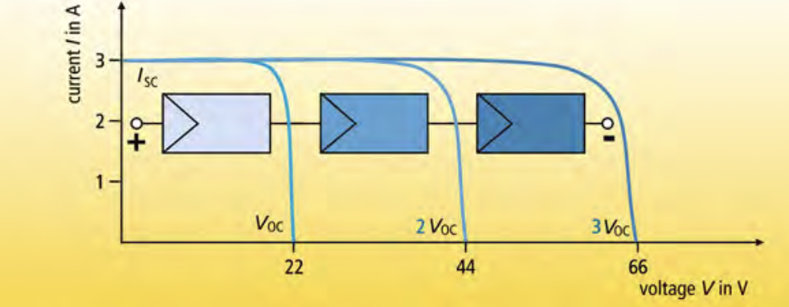
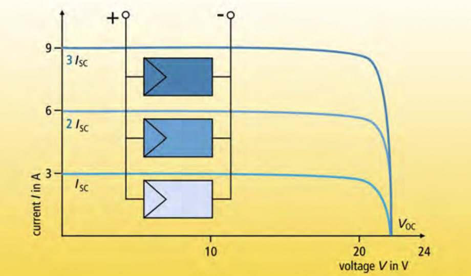
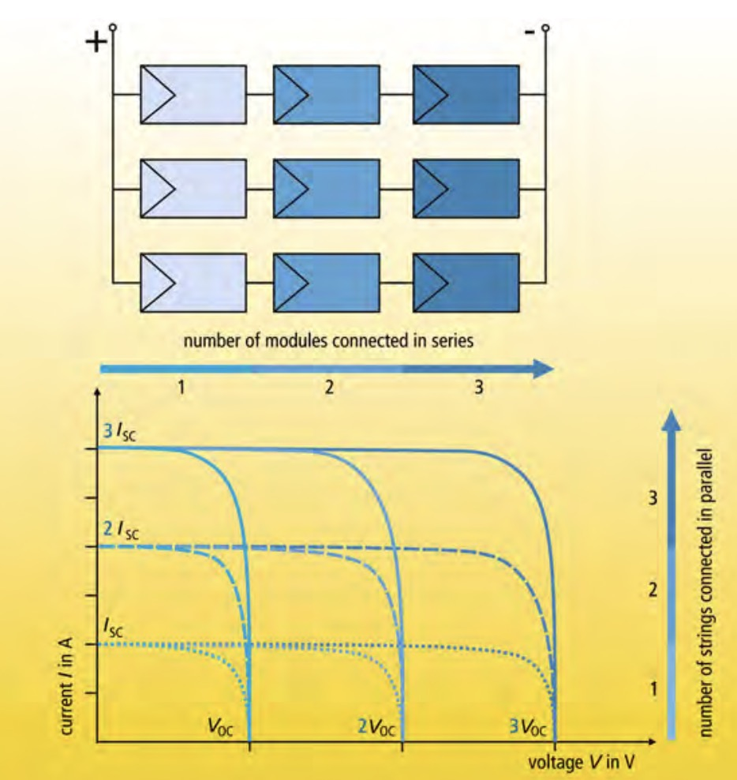
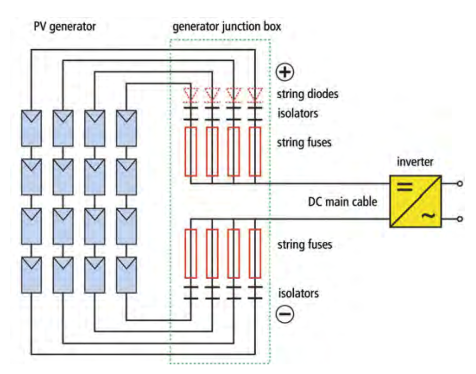
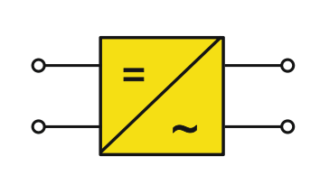
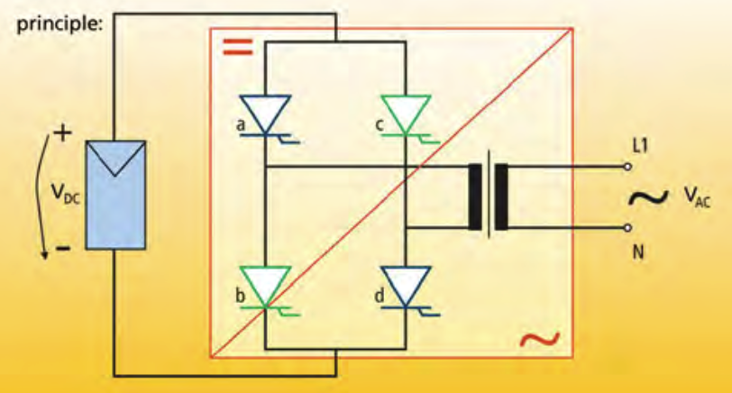
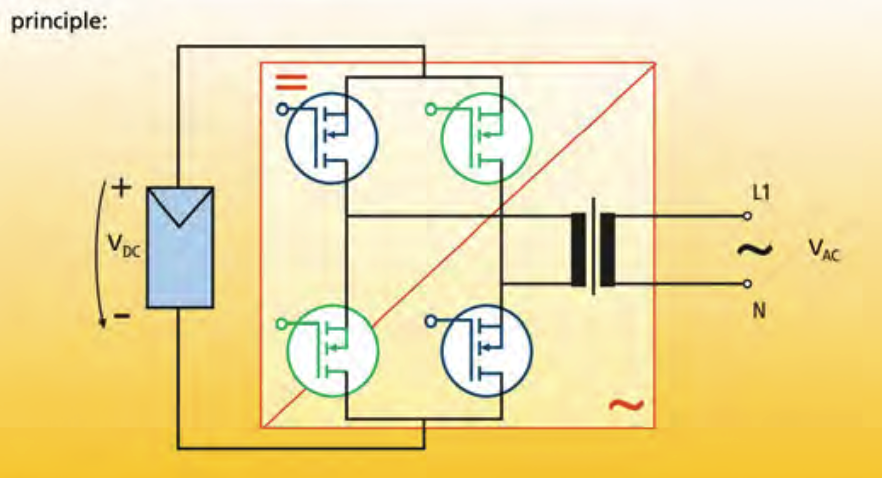

# 
Photovaltaic Notes

In a solar facility, sunlight is captured by photovoltaic (PV) modules series-connected into strings. These strings transform the solar energy into direct current (DC). The DC then travels to a junction box that groups parallelly aligned, electronically identical strings. This box is equipped with diodes, an isolator, and fuses to provide protections such as preventing reverse current flow and overheating of individual strings.

Next, the DC flows into the inverter, and is converted to alternating current (AC) that can be used to power our homes. The inverters also help to monitor maximum power (MPP) and other operation data. Self-commutated inverters are widely used in this process for their ability to switch on and off, generating a sinusoidal current wave. While transformers within inverters provide electrical isolation and minimize interferences, transformerless inverters have the highest efficiency due to the elimination of energy loss.

----
## **1. Photovoltaic (PV) Modules**

PV: The process of converting light (photons) to electricity (voltage).

PV Modules: modules are connected in series and parallel. As shown in table below:

|  | **series connection** | **parallel connection** |
| --- | --- | --- |
| **system** | grid-connected PV system | stand-alone PV system (one module per string) |
| **current(in A) vs. voltage(in V)** | same current, add up voltage | same voltage, add up current |
| **name** | string | - |
| **structure** |  |  |

Note: 
- Use same type of modules to avoid power loss. Same type means same manufacturer, model, etc.
- We also want the module to be electrically identical, meaning same current and voltage. But in practice we allow some tolerance.
- DC voltage decreases and current increases, as temperature increases.

In reality, the PV generator is a combination of series and parallel connected modules. As shown in image below:

Note:
- Suppose each module has current of 2A, voltage of 50V.
- In above image, three are 3 parallel strings, each string has 3 modules connected in series.
- So each string has current of 2A, voltage of 150V (3*50V).
- The whole system has current of 6A (3*2A)
- Total power is 300W (6A*150V)

----
## **2. PV Array Junction Box**

Purpose: combine all parallelly aligned strings into one DC output. As shown in image below:

Components: diodes, isolator, fuses, DC main cable
- fuses: 
  - protect wiring against overloading
  - it will blow when current exceeding (short circuit) has occurred
- diodes:
  - connect to each string (decouple strings), only allow current to flow in forward direction
  - if short circuit or shading occurred for one string, other strings should not be affected, as the diode will prevent current from flowing back to the failed string
  - tiny power loss during current flow
  - string diodes may be excluded in new technology for grid-connected PV systems
- isolator:
  - functions mainly to switch off, isolate, and protect the system, e.g when testing or maintenance
- DC main cable:
  - connects the junction box to the inverter

Note:
- Short circuit: when the current is too high, the voltage will drop to zero (no or little resistance).
- Shading: WHAT IS THIS??

----
## **3. Inverter**
Symbol, as shown in image below:

Funtionalities:
1. convert DC to AC
2. adjustment of the inverter’s operating point to the MPP of the PV modules (MPP tracking)
3. recording of the operating data and signalling (e.g. display, data storage and data transfer)
4. Grid monitoring or grid management

Two types: grid-connected inverter and stand-alone inverter. As shown in table below:

|  | **grid-connected inverter** | **stand-alone inverter** |
| --- | --- | --- |
| **components** | bridge circuit with thyristors | blur yet |
| **principle** |  |  |
| **wave** | add img | add img, this is more popular |

Due to problem of electromagnetic compatibility (EMC), transformer is introduced to the inverter. It mainly functions to:
- provide electrical isolation
- minimize interferences
- etc

One phase and three phase inverter.

|  | **transformer** | **transformerless** |
| --- | --- | --- |
| **pros** | - | less weight so reduce energy loss |

We also need to compare low-frequency and high-frequency transformer. As shown in table below:

|  | **low-frequency transformer** | **high-frequency transformer** |
| --- | --- | --- |
| **pros** | - | - |

----
## **4. Calculation**

Efficiency calculation: Conversion efficiency, Adaptive efficiency, Static efficiency, Euro efficiency, Californian efficiency, Overall efficiency. (No need to know much about this).